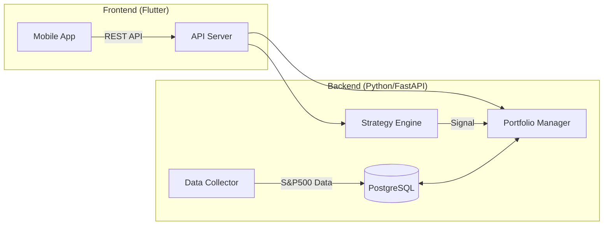

# 📈 Robo (S&P 500 AI Robo-Advisor)

**Python 기반의 트레이딩 엔진**과 **Flutter 모바일 대시보드**가 통합된 풀스택 로보어드바이저 플랫폼입니다.
S&P 500 전 종목을 분석하여 최적의 매매 타이밍을 포착하고, 모의투자를 통해 자산을 관리할 수 있습니다.

## 🏗 System Architecture

시스템은 크게 데이터 수집 및 전략 실행을 담당하는 **Backend Server**와 사용자 인터페이스를 담당하는 **Mobile App**으로 구성됩니다.

 

## 🛠 Tech Stack

본 프로젝트는 유지보수의 용이성, 확장성, 그리고 현업 수준의 아키텍처를 고려하여 다음과 같은 기술 스택을 사용합니다.

| Category | Technology | Description |
| :--- | :--- | :--- |
| **Backend Framework** | **Python, FastAPI** | 고성능 비동기 REST API 및 트레이딩 엔진 |
| **Frontend Framework** | **Flutter (Dart)** | iOS/Android 크로스 플랫폼 모바일 앱 |
| **Database** | **PostgreSQL** | 시계열 주가 데이터 및 매매 기록 저장 |
| **Data Processing** | **Pandas, NumPy** | 금융 데이터 벡터 연산 및 퀀트 분석 |
| **Infrastructure** | **Docker** | 데이터베이스 및 서비스 가상화 환경 |

 

## 📅 Detailed Roadmap (Future Goals)

단계별 개발 목표입니다.
Phase 1: MVP 구축 (완료 ✅)

    [x] Backend: FastAPI 서버 구축 및 PostgreSQL DB 연동

    [x] Data: S&P 500 전 종목 일봉 데이터 수집기 구현

    [x] Strategy: 기본 전략 패턴 구현 (Golden Cross, RSI)

    [x] App: Flutter 기본 대시보드 UI 및 REST API 연동

    [x] Logic: 매매 로그 기반 현금/자산 회계 처리 로직 구현

Phase 2: 앱 고도화 및 UI/UX 개선 (진행 중 🚧)

    [ ] Navigation: 하단 탭바(Bottom Navigation) 구현 (대시보드 / 추천종목 / 설정)

    [ ] Chart: 앱 내 주가 차트 시각화 (Candlestick Chart 적용)

    [ ] Detail View: 종목 클릭 시 상세 정보 및 매매 내역 조회 화면 구현

    [ ] Search: 종목 검색 기능 및 관심 종목(Watchlist) 등록 기능

Phase 3: 전략 및 데이터 확장

    [ ] Fundamental Data: PER, PBR, ROE 등 재무 데이터 DB 추가

    [ ] Backtesting: 과거 데이터 기반 전략 수익률 검증 및 시각화 모듈

    [ ] Advanced Strategy: 듀얼 모멘텀, 변동성 돌파 등 고급 전략 추가

    [ ] AI/ML: 머신러닝 기반 주가 예측 모델(LSTM/XGBoost) 실험적 도입

Phase 4: 실전 투자 및 운영 자동화

    [ ] Broker API: 한국투자증권(KIS) 또는 키움증권 Open API 연동

    [ ] Scheduler: 장 시작 전/후 데이터 수집 및 매매 자동화 (Airflow/Cron)

    [ ] Notification: 매매 체결 및 추천 종목 발생 시 Slack/Telegram 알림

    [ ] Cloud Deploy: AWS(EC2, RDS) 배포 및 CI/CD 파이프라인 구축
