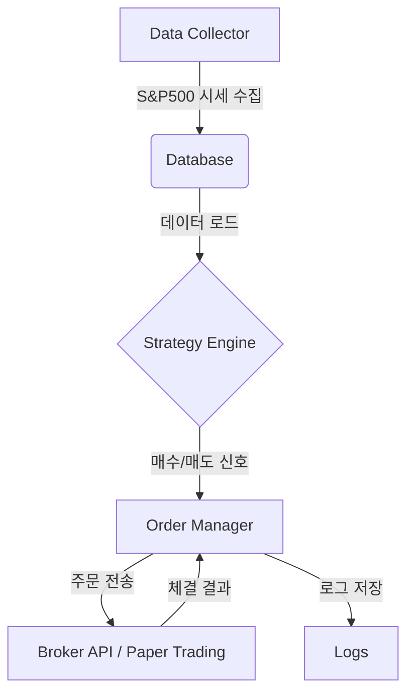

# 🏗 시스템 아키텍처

## 데이터 흐름도 (Data Flow)

```mermaid
graph TD
    A[Data Collector] -->|S&P500 시세 수집| B(Database)
    B -->|데이터 로드| C{Strategy Engine}
    C -->|매수/매도 신호| D[Order Manager]
    D -->|주문 전송| E[Broker API / Paper Trading]
    E -->|체결 결과| D
    D -->|로그 저장| F[Logs]
```

## 모듈 설명
1. **Collector**: 매일 장 마감 후 yfinance를 통해 일봉 데이터 업데이트
2. **Strategy Engine**: 장 시작 전, DB 데이터를 기반으로 타겟 종목 선정
